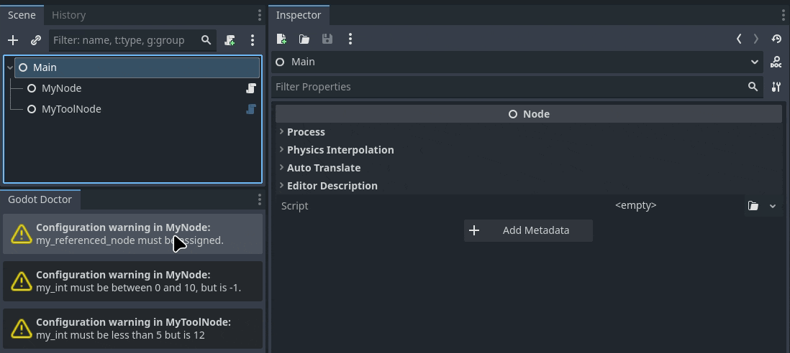

# Godot Doctor 🩺

A powerful scene validation plugin for Godot that provides a cleaner, more maintainable alternative to `_get_configuration_warnings()`, that doesn't require gameplay scripts to be `@tool`.

## What is Godot Doctor?

Godot Doctor is a Godot plugin that validates your scenes and nodes using a declarative, test-driven approach. Instead of writing procedural warning code, you define validation conditions using callables that focus on validation logic first, with error messages as metadata.

## Why Use Godot Doctor?

### 🏷️ **No `@tool` Required**
Unlike [`_get_configuration_warnings()`](https://docs.godotengine.org/en/4.5/classes/class_node.html#class-node-private-method-get-configuration-warnings), Godot Doctor works without requiring the [`@tool`](https://docs.godotengine.org/en/4.5/tutorials/plugins/running_code_in_the_editor.html#what-is-tool) annotation on your scripts.
This means that you no longer have to worry about your gameplay code being muddied by editor-specific logic.

So this:

```gdscript
@tool
extends Node
class_name MyNode

@export var my_button: Button

func _ready():
   my_button.pressed.connect(_on_button_pressed)


func _get_configuration_warnings() -> PackedStringArray:
   var errors: PackedStringArray = []
   if not my_button:
      errors.append("my_button is not assigned!")
   return errors


func _on_button_pressed():
   # do something


func _process(delta: float) -> void:
	if Engine.is_editor_hint():
		return
	# game logic here


func _notification(what: int) -> void:
   match what:
      NOTIFICATION_EDITOR_POST_SAVE:
            update_configuration_warnings()
```

Now just becomes this:

```gdscript
extends Node
class_name MyNode

@export var my_button: Button


func _ready():
   my_button.pressed.connect(_on_button_pressed)


func _get_validation_conditions() -> Array[ValidationCondition]:
	return [
		ValidationCondition.simple(is_instance_valid(my_button), "my_button is not assigned!")
	]


func _process(delta: float) -> void:
	# game logic here


func _on_button_pressed():
   # do something
```

Allowing you to keep your gameplay code clean and focused!

### ⚙️Validate Nodes AND Resources 

Godot Doctor can not only validate nodes in your scene, but `Resource` scripts can define their own validation conditions as well. 
Very useful for validating whether your resources have conflicting data (i.e. a value that is higher than the maximum value), or missing references (i.e. an empty string, or a missing texture).

### 🧪 Test-Driven Validation
Godot Doctor encourages you to write validation logic that resembles unit tests rather than write code that returns strings containing warnings. This encourages:
- Testable validation logic
- Organized code
- Better maintainability 
- Human-readable validation conditions
- Separation of concerns between validation logic and error messages

### 🔄 Automatic Scene Validation
Validations run automatically when you save scenes, providing immediate feedback during development.
Errors are displayed in a dedicated dock, and you can click on them to navigate directly to the problematic nodes.



### 🎯 Declarative Syntax

Where `_get_configuration_warnings()` makes you write code that generates strings, Godot Doctor lets you design your validation logic separately from the error messages, making it easier to read and maintain.

## Validation Syntax

### ValidationCondition

The core of Godot Doctor is the `ValidationCondition` class, which takes a callable and an error message:

```gdscript
# Basic validation condition
var condition = ValidationCondition.new(
    func(): return health > 0,
    "Health must be greater than 0"
)
```

### Simple Helper Method

For basic boolean validations, use the convenience `simple()` method, allowing you to skip the `func()` wrapper: 

```gdscript
# Equivalent to the above, but more concise
var condition = ValidationCondition.simple(
    health > 0,
    "Health must be greater than 0"
)
```

### Reuse validation logic with Callables 

Using `Callables` allows you to reuse common validation methods:

```gdscript
func _is_more_than_zero(value: int) -> bool:
	 return value > 0

var condition = ValidationCondition.simple(
	 _is_more_than_zero(health),
	 "Health must be greater than 0"
)
```

### Abstract Away Complex Logic

Or abstract away complex logic into separate methods:

```gdscript
var condition = ValidationCondition.new(
	 complex_validation_logic,
	 "Complex validation failed"
)

func complex_validation_logic() -> bool:
	# Complex logic here
```

### Nested Validation Conditions

Making use of variatic typing, Validation conditions can return arrays of other validation conditions, allowing you to nest validation logic where needed:

```gdscript
ValidationCondition.new(
			func() -> Variant:
				if not is_instance_valid(my_resource):
					return false
				return my_resource.get_validation_conditions(),
			"my_resource must be assigned."
		)
```

## How It Works

1. **Automatic Discovery**: When you save a scene, Godot Doctor scans all nodes for the `_get_validation_conditions()` method
2. **Instance Creation**: For non-`@tool` scripts, temporary instances are created to run validation logic
3. **Condition Evaluation**: Each validation condition's callable is executed
4. **Error Reporting**: Failed conditions display their error messages in the Godot Doctor dock
5. **Navigation**: Click on errors in the dock to navigate directly to the problematic nodes

## Examples

For detailed examples and common validation patterns, see [the examples README](./addons/godot_doctor/examples/README.md).

## Installation

1. Copy the `addons/godot_doctor` folder to your project's `addons/` directory
2. Enable the plugin in Project Settings > Plugins
3. The Godot Doctor dock will appear in the editor's left panel
4. Start adding `_get_validation_conditions()` methods to your scripts, then save your scenes to see validation results!

## License

Godot Doctor is released under the MIT License. See the LICENSE file for details.
